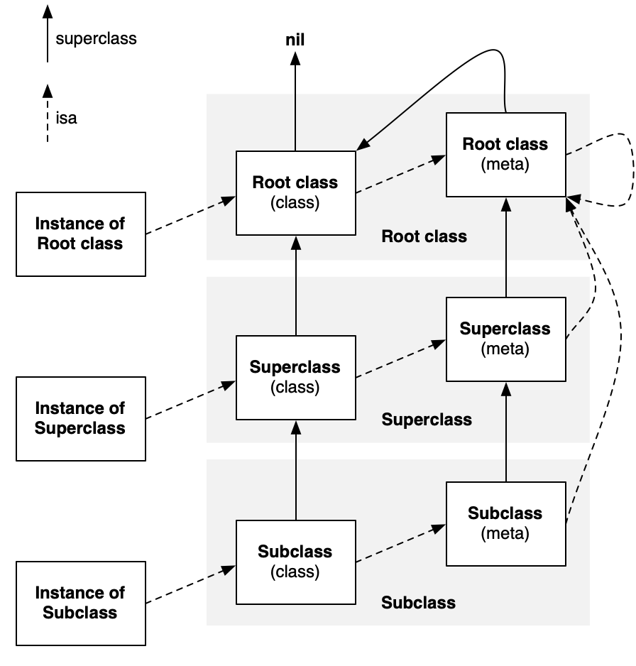

# iOS 八股大法

## Foundation

> 语言层面的八股知识点，尽可能刁钻的问题

看文章很难记住，还是代码跑起来比较直观：

`open ./Foundation/ObjcBagu/ObjcBagu.xcodeproj`

所以这里只简单列一些要点

### I. ARC/MRC ★★★☆☆

`ARC is supported in Xcode 4.2 for OS X v10.6 and v10.7 (64-bit applications) and for iOS 4 and iOS 5.`

现在除了一些老项目，基本没有 MRC 为主的代码了，所以只需要简单了解下 MRC 与 ARC 的区别即可

1. MRC 需要手动写 dealloc，并且一定要最后再调用父类的 dealloc；
   ARC 一般不需要写 dealloc，也不需要调用 [super dealloc]。移除 NSNotification Observer 和 KVC Observer 例外。

2. 在 ARC 的工程中使用 MRC，需要在工程中设置源文件的编译选项 `-fno-objc-arc`

### II. AutoReleasePool ★★★★☆

* AutoReleasePool 的数据结构

* AutoReleasePool 与 @autoreleasePool

### III. Block ★★★★★

* block 的结构体类型

* block 如何捕获外部变量

* 循环引用 与 [Weak-Strong Dance](Foundation/Notes/weak-strong-dance.md)

### IV. Category ★★★★★

* load 加载时机

* load 与 initialze

* category 覆盖原类方法的原理

* category 同名方法调用顺序

### V. HotPatch ★☆☆☆☆

* JSPatch 的原理

### VI. KVC ★★☆☆☆

* KVC 是如何实现的

### VII. KVO ★★★★☆

* KVO 的原理

### VIII. MultiThread ★★★★☆️

* 哪些多线程方法

* 互斥锁与自旋锁
### IX. Network ★★★☆☆️

* NSURLSession 与 NSURLConnection
### X. NSTimer ★★★★★️

* timer 与 Runloop

* timer 导致循环引用的产生与解决

### XI. Property ★★★★★️

* 不同属性的区别

* weak 与 copy

* atomic 并不是线程安全的

* 如何实现一个弱引用容器
   - \+ [NSPointerArray weakObjectsPointerArray] 弱引用数组
   - \+ [NSMapTable weakToWeakObjectsMapTable] 弱引用表
   - \+ [NSHashTable weakObjectsHashTable] 弱引用 hash 表
   - \+ [NSValue valueWithNonretainedObject:] 弱引用对象

### XII. Runloop ★★★★☆️

* Runloop 与线程的关系

* 如何实现一个常驻线程

### XIII. Runtime ★★★★★

> 详解：[Runtime 详解](Foundation/Notes/runtime.md)

一图胜千言，引用 Runtime 工程师 [Greg Parker](http://www.sealiesoftware.com/blog/archive/2009/04/14/objc_explain_Classes_and_metaclasses.html) 在其博客中给出的经典图

---
## UIKit

> UIKit/AppKit 与界面相关的八股知识点